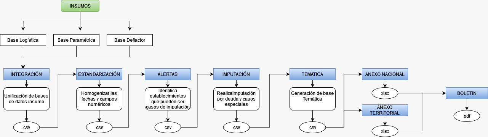

<!-- README.md is generated from README.Rmd. Please edit that file -->

```{r, include = FALSE}
knitr::opts_chunk$set(
  collapse = TRUE,
  comment = "#>",
  fig.path = "man/figures/README-",
  out.width = "100%"
)
```

# DANE.EMMET

<!-- badges: start -->
<!-- badges: end -->

Este paquete tiene como objetivo optimizar los tiempos del proceso que se realiza para la encuesta mensual manufacturera con enfoque territorial (EMMET). La cual sigue el siguiente flujo:


## Instalación

Para instalar la libreria de "DANE.EMMET" se realiza con el comando
```{r,eval=FALSE}
#instalar la libreria
remotes::install_github("sub-dane/EMMET")
#cargar la libreria
library(DANE.EMMET)
```

## Instalación Java

Esta función requiere que su computador cuente con Java, pues se usa la librería xlsx, y ésta con la ayuda de Java sobre-escribe algunos archivos de excel, y genera varias hojas dentro del mismo y, con ellos, genera el archivo final de los anexos.

La instalación de Java se puede realizar para Windows, Linux y Mac.

  Para Windows:

  a. Entre el sitio web oficial de Java en https://www.oracle.com/java/ y haga clic en "Descargar" o "Get Java".

  b. En la página de descargas, asegúrase de seleccionar la versión correcta de Java para Windows, ya sea de 32 o 64 bits, dependiendo de su sistema operativo.

  c. Haga clic en el enlace de descarga correspondiente y acepte los términos y condiciones de Oracle.

  d. Una vez que se complete la descarga, haga doble clic en el archivo de instalación y siga las instrucciones del asistente de instalación.

  e. Durante la instalación, es posible que se le solicite elegir una ubicación para instalar Java. Por lo general, se recomienda utilizar la ubicación predeterminada.

  f. Una vez finalizada la instalación, verifique que Java se haya instalado correctamente abriendo la línea de comandos y ejecutando el comando "java -version". Debería ver la versión de Java instalada en su sistema.

  Para Mac:

  a. En su Mac, abra un navegador web e ingrese al sitio web oficial de Java en https://www.oracle.com/java/ y haga clic en "Descargar" o "Get Java".

  b. En la página de descargas, asegúrase de seleccionar la versión correcta de Java para macOS.

  c. Haga clic en el enlace de descarga correspondiente y acepte los términos y condiciones de Oracle.

  d. Una vez que se complete la descarga, haga doble clic en el archivo de instalación y siga las instrucciones del asistente de instalación.

  e. Durante la instalación, es posible que se le solicite ingresar la contraseña de administrador de su Mac.

  f. Una vez finalizada la instalación, verifique que Java se haya instalado correctamente abriendo la Terminal y ejecutando el comando "java -version". Debería ver la versión de Java instalada en su sistema.

Dependiendo de las versiones específicas de Java y de los sistemas operativos que estés utilizando, algunos pasos o detalles podrían variar.

## Uso

Esta libreria se puede usar de 2 maneras

1. Funciones individuales: la librera consta de las siguientes funciones individuales

-f0_inicial(directorio)

-f1_integracion(directorio,mes,anio)

-f2_estandarizacion(directorio,mes,anio)

-f3_identificacion_outliers(directorio,mes,anio)

-f4_imputacion_outliers(directorio,mes,anio)

-f5_tematica(directorio,mes,anio)

-f6_anacional(directorio,mes,anio)

-f7_aterritorial(directorio,mes,anio)

-f8_boletin(directorio,mes,anio,tipo="pdf")

-f9_shiny(directorio,mes,anio)

Las cuales se puden correr una a una para asi poder revisar los archivos de salida de cada función.

2. Funciones macro: la libreria cuenta con dos macro funciones

-macro1(directorio,mes,anio): la cual corre las funciones f0_inicial,f1_integracion,f2_estandarizacion e f3_identificacion_alertas, para que asi el usuario pueda verificar y modificar las alertas, y luego continuar con el proceso.

-f9_shiny(directorio,mes,anio): la cual sirve para poder visualizar las alertas hasta el momento.

-macro2(directorio,mes,anio): una vez modificado el archivo de alertas podemos continuar con el proceso, con esta macro funcion se corren las funciones f4_imputacion,f5_tematica f6_anacional,f7_aterritorial y f8_boletin.

## Ejemplos

1. Ejemplo de usar las funciones de manera individual, se deben correr en orden ya que las funciones cargan la salida de la función respectivamente anterior

```{r example,eval=FALSE}
#cargar la libreria
library(DANE.EMMET)
#correr funcion inicial
f0_inicial(directorio="Documents/DANE/Procesos DIMPE /PilotoEMMET")
# correr funcion integracion
f1_integracion(directorio="Documents/DANE/Procesos DIMPE /PilotoEMMET",mes=11,anio=2022)
# correr funcion estandarizacion
f2_estandarizacion(directorio="Documents/DANE/Procesos DIMPE /PilotoEMMET",mes=11,anio=2022)
# correr funcion identificacion_outliers
f3_identificacion_outliers(directorio="Documents/DANE/Procesos DIMPE /PilotoEMMET",mes=11,anio=2022)
# correr funcion imputacion_outliers
f4_imputacion_outliers(directorio="Documents/DANE/Procesos DIMPE /PilotoEMMET",mes=11,anio=2022)
# correr funcion tematica
f5_tematica(directorio="Documents/DANE/Procesos DIMPE /PilotoEMMET",mes=11,anio=2022)
# correr funcion anacional
f6_anacional(directorio="Documents/DANE/Procesos DIMPE /PilotoEMMET",mes=11,anio=2022)
# correr funcion aterritorial
f7_aterritorial(directorio="Documents/DANE/Procesos DIMPE /PilotoEMMET",mes=11,anio=2022)
# correr funcion boletin
f8_boletin(directorio="Documents/DANE/Procesos DIMPE /PilotoEMMET",mes=11,anio=2022,tipo="word")
#correr funcion shiny
f9_shiny(directorio="Documents/DANE/Procesos DIMPE /PilotoEMMET",mes=11,anio=2022)


```

Se puede revisar el archivo de salida despues de cada función

2. Ejemplo de como usar las macro funciones

```{r macro,eval=FALSE}
#cargar la libreria
library(DANE.EMMET)
#correr funcion macro1
macro1(directorio="Documents/DANE/Procesos DIMPE /PilotoEMMET",mes=11,anio=2022)
#verificar y/o modificar el archivo de alertas para continuar con el proceso

#verificar si se requiere la aplicación shiny
f9_shiny(directorio="Documents/DANE/Procesos DIMPE /PilotoEMMET",mes=11,anio=2022)

#correr funcion macro2
macro2(directorio="Documents/DANE/Procesos DIMPE /PilotoEMMET",mes=11,anio=2022,tipo="pdf")
```

